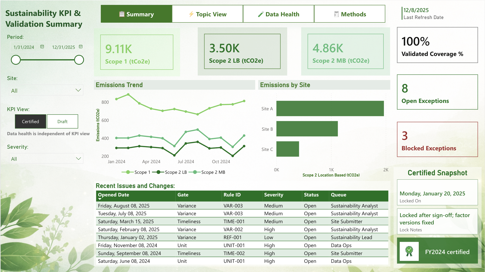
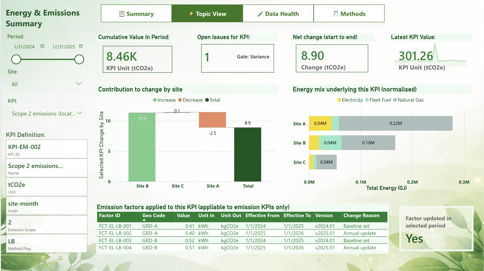
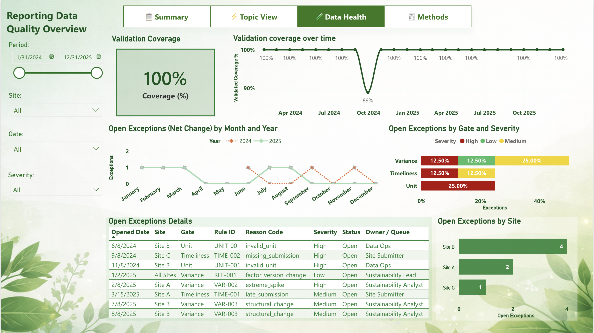

# Sustainability Reporting System  
An end-to-end analytics portfolio project

This repository contains a complete analytics case study that starts with **problem framing and reporting design**, and only then moves into artefacts, data modelling, and dashboarding.

The project was intentionally designed to mirror how real analytics and reporting work begins: with a **framing deck**, not a tool.

Synthetic data is used throughout.

---

## What this project is (and is not)

This is **not** a single Power BI dashboard built on a dataset.

This is a system-level analytics project that includes:
- Problem framing and reporting design
- KPI definitions and governance artefacts
- A reporting-grade data model
- An interactive Power BI dashboard
- Written documentation explaining design decisions and trade-offs

The dashboard is the output.  
The thinking behind it is the product.

---
## How this project was built

The project follows a deliberate lifecycle, similar to a consulting or internal analytics engagement.

1. **Problem framing and reporting design**  
   The work started with a slide deck that defined:
   - The reporting problem being solved
   - The intended users and decisions
   - The questions the system must be able to answer
   - The separation of reporting views by purpose

   This deck acts as the contract for the rest of the system.

2. **Governance and analytical artefacts**  
   Based on the framing, I created supporting artefacts such as:
   - KPI catalogue and definitions
   - Emission factor register
   - Validation rules and exception logic
   - Data ownership and responsibility mapping

3. **Data model design**  
   The data model was designed to support reporting, explanation, and auditability rather than raw ingestion.

4. **Dashboard implementation**  
   The Power BI dashboard was built last, translating the design decisions and artefacts into an interactive reporting experience.
---

## Project structure

sustainability-reporting-system/
│
├── 01_problem_framing/
│   └── Sustainability_Reporting_Overview.pdf # Framing deck that defines the problem, users, and reporting structure
│
├── 02_artefacts/
│   ├── KPI_Catalogue.xlsx
│   ├── Emission_Factor_Register.xlsx
│   ├── Validation_Rules_Spec.xlsx
│   └── Data_Ownership_and_Responsibilities.xlsx
│
├── 03_data_model/
│   ├── Data_Model_Diagram.png
│   └── Table_Descriptions.md
│
├── 04_dashboard/
│   ├── Sustainability_Reporting.pbix
│   └── Dashboard_Screenshots/
│       ├── Summary.png
│       ├── Energy_and_Emissions.png
│       ├── Data_Health.png
│       └── Methods.png
│
└── writeup/
├── 01_problem_statement.md
├── 02_project_scope_and_users.md
├── 03_kpi_and_reporting_design.md
├── 04_data_modeling_decisions.md
├── 05_dashboard_page_rationale.md
├── 06_assumptions_and_limitations.md
└── 07_future_extensions.md

---
## Start here

If you want to understand the project end to end:

1. Open `01_problem_framing/Sustainability_Reporting_Overview.pdf`
2. Skim `writeup/01_problem_statement.md`
3. Review the dashboard screenshots
4. Open the Power BI file if you want to explore interactively

If you have **30 seconds**:
- Scroll through the dashboard screenshots below.

If you have **5 minutes**:
- Read `writeup/01_problem_statement.md`
- Skim `writeup/05_dashboard_page_rationale.md`
---
## Dashboard overview

### 1. Summary  
Purpose: provide a certified, executive-level view of sustainability performance.

This page answers:
- Where do we stand right now?
- Are numbers certified or still draft?
- Are there any blocking issues?

---

### 2. Energy & Emissions  
Purpose: explain *why* a KPI value is what it is.

This page answers:
- What exactly is being measured?
- What changed between periods?
- Which sites drove the change?
- Which emission factors were applied?
- Are there data issues affecting this KPI?

This is a deep-dive analytical workbench, not a scorecard.

---

### 3. Data Health and Controls  
Purpose: assess trust in the reported data.

This page answers:
- Is data complete and validated?
- Where are exceptions accumulating?
- Are issues improving or getting worse?

It treats data quality as a first-class reporting concern.

---

### 4. Methods and Assumptions  
Purpose: document how numbers are calculated and governed.

This page answers:
- How is each KPI calculated?
- Which factor sets and versions apply?
- What assumptions and exclusions exist?
- Who owns which data?

This page is designed for auditors and reviewers, not executives.

---

## Data model

The data model is designed to separate:
- Raw activity data
- Calculated KPI outputs
- Data quality and validation events
- Emission factors and methodology
- Certification and governance metadata

A full description is available in:
- `03_data_model/Data_Model_Diagram.png`
- `03_data_model/Table_Descriptions.md`

---

## Power BI file

The Power BI report embeds all required data and opens locally without external dependencies.

To view the dashboard:
1. Download `04_dashboard/Sustainability_Reporting.pbix`
2. Open it in Power BI Desktop (latest version recommended)

No credentials or external data sources are required.

---

## Written walkthrough

The `writeup/` folder contains the full narrative behind the project:
- Why the problem was chosen
- Who the system is designed for
- How KPIs are governed
- Why the model looks the way it does
- What each dashboard page is meant to answer
- Explicit assumptions and limitations
- How the system could scale

These documents are intended to make the project understandable even without opening the dashboard.

---

## Key takeaways

This project demonstrates:
- Problem framing before tooling
- System-level thinking in analytics
- Reporting-grade data modelling
- KPI governance and certification logic
- Intentional dashboard design
- Clear articulation of assumptions and limits

It is designed to resemble real analytics work, not a demo.

---

## Notes

- All data used is synthetic.
- The project is intended for portfolio and demonstration purposes.
- Visual design is intentionally restrained to prioritise clarity and credibility.

---

If you are reviewing this project as part of a hiring process and would like a walkthrough, feel free to reach out.

